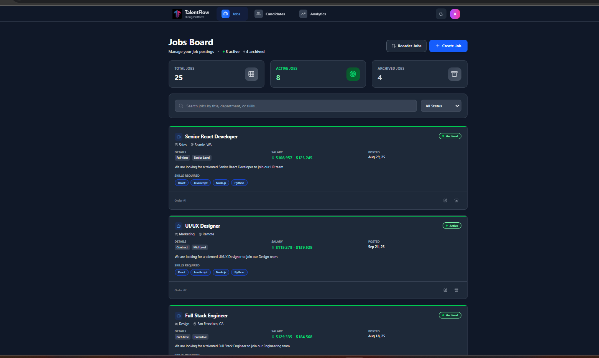
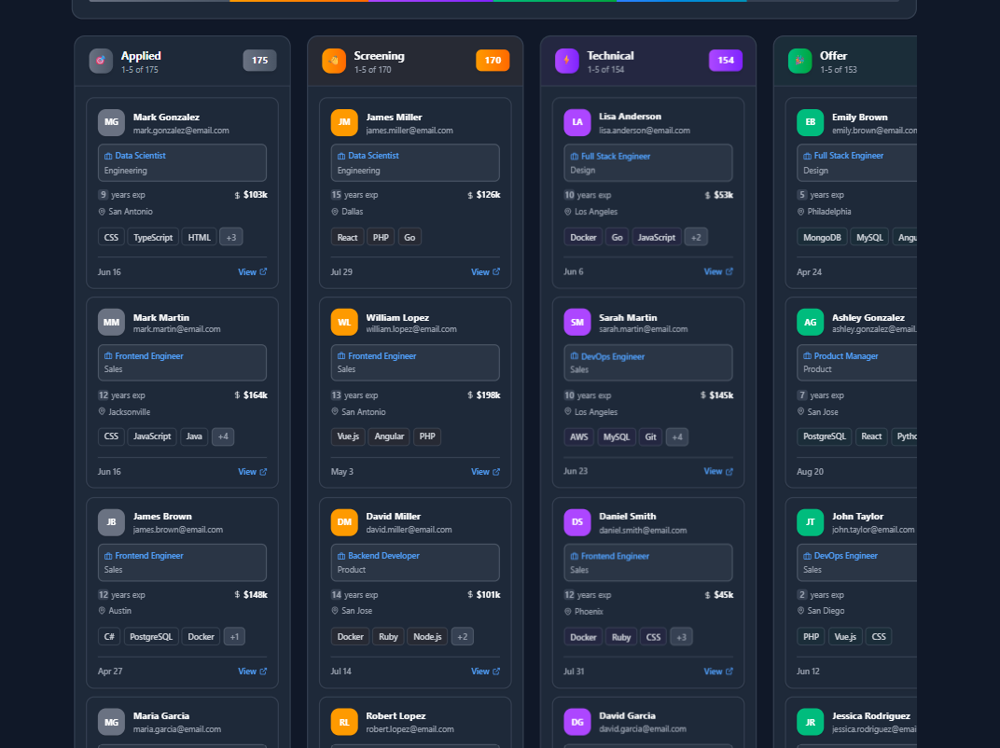
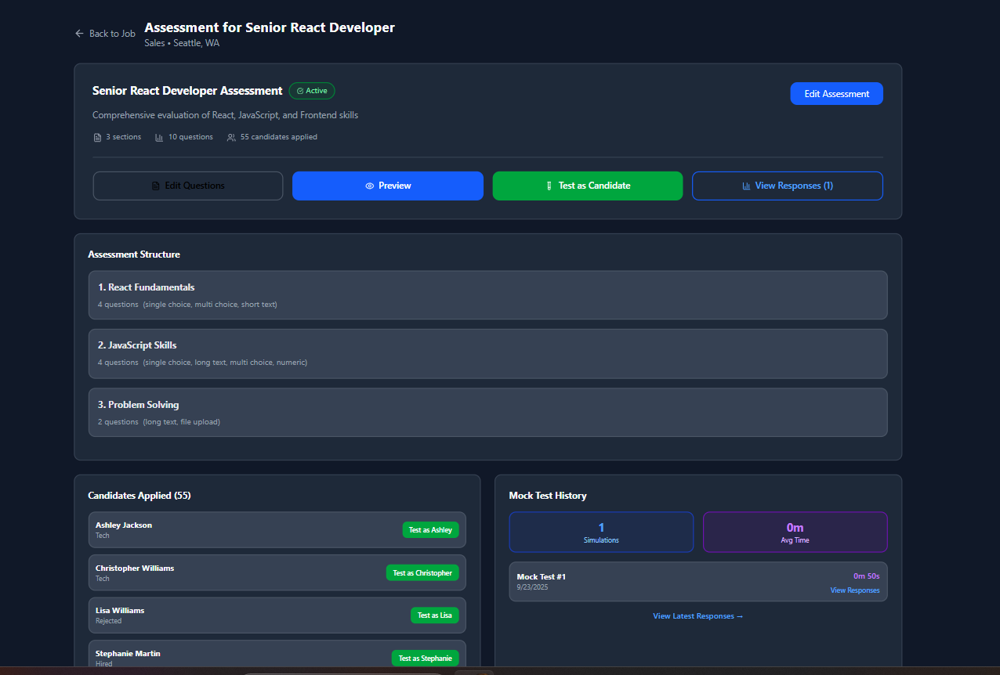
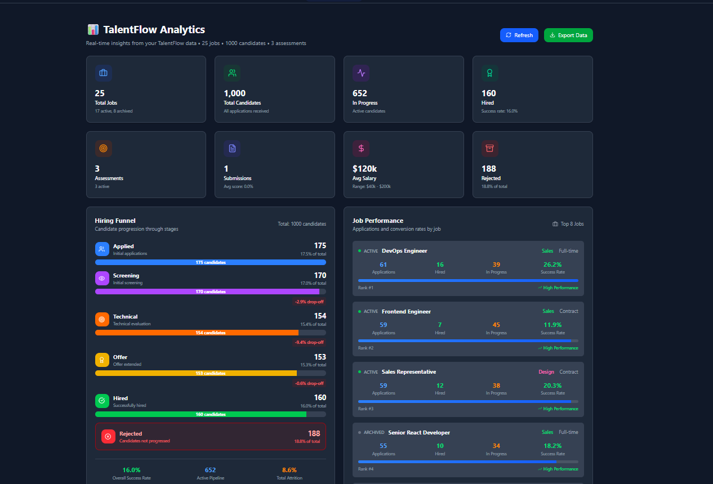

# TalentFlow

TalentFlow is a modern, modular recruitment and assessment platform for HR teams and tech companies. It streamlines the hiring process with job management, candidate pipelines, and customizable assessments—all in a beautiful, responsive UI.

---

## Table of Contents
- [Features](#features)
- [Screenshots](#screenshots)
- [Tech Stack](#tech-stack)
- [Project Structure](#project-structure)
- [Architecture Overview](#architecture-overview)
- [Getting Started](#getting-started)
- [Usage](#usage)
- [Development Tips](#development-tips)
- [Contributing](#contributing)
- [License](#license)

---

## Features
- **Job Board**
  - Create, edit, archive, and reorder job postings with drag-and-drop (dnd-kit)
  - View job details, requirements, and analytics
- **Candidate Management**
  - Kanban board for tracking candidates through custom stages
  - Candidate profile with notes, timeline, and resume upload
  - Activity log and @mentions in notes
- **Assessment Builder**
  - Build multi-section assessments with:
    - Short/long text, numeric, single/multi-choice, file upload questions
    - Section and question reordering
    - Live preview and simulation modes
    - Validation, required fields, and custom instructions
- **Analytics Dashboard**
  - Visualize hiring funnel, job performance, and candidate stats
  - Downloadable reports (CSV, PDF)
- **Dark Mode**
  - Fully themeable interface with light/dark toggle
- **API Ready**
  - Easily connect to your backend or use the included mock service worker (MSW) for local development
- **Local Storage**
  - All data is stored in IndexedDB (Dexie.js) for fast prototyping

---

## Screenshots
> 

- 
- 
- 

- 

---

## Tech Stack
- **Frontend**: React, Vite, Tailwind CSS
- **State Management**: React Context, hooks
- **Drag & Drop**: dnd-kit
- **Icons**: Lucide React
- **Mock API**: MSW (Mock Service Worker)
- **Local DB**: Dexie.js (IndexedDB)

## Project Structure
```
TalentFlow/
  ├── public/                # Static assets
  ├── src/
  │   ├── components/        # Common UI components
  │   ├── features/          # Domain features (jobs, candidates, assessments, dashboard)
  │   ├── hooks/             # Custom React hooks
  │   ├── services/          # API, mock data, handlers
  │   ├── store/             # App-wide state
  │   ├── styles/            # Tailwind and custom CSS
  │   └── utils/             # Helpers, constants, formatters
  ├── index.html
  ├── package.json
  ├── vite.config.js
  └── README.md
```

---

## Architecture Overview
- **App Entry**: `src/main.jsx` bootstraps the app, sets up theme and mock API.
- **Routing**: React Router for navigation between jobs, candidates, assessments, and dashboard.
- **State**: Context and hooks for global state (jobs, candidates, assessments, UI theme).
- **Persistence**: Dexie.js for IndexedDB local storage; easy to swap for real API.
- **Mock API**: MSW intercepts fetch requests for local development.
- **UI**: Tailwind CSS for rapid, responsive design; Lucide icons for clarity.

---

## Getting Started

### Prerequisites
- Node.js (v16+ recommended)
- npm or yarn

### Installation
```sh
npm install
# or
yarn install
```

### Development
```sh
npm run dev
# or
yarn dev
```

### Build
```sh
npm run build
# or
yarn build
```

### Lint
```sh
npm run lint
# or
yarn lint
```

---

## Usage
- **Job Board**: Manage job postings, reorder with drag-and-drop, archive/unarchive jobs.
- **Candidates**: Move candidates through pipeline stages, add notes, view profiles.
- **Assessments**: Build, preview, and simulate candidate assessments with rich question types.
- **Dashboard**: View analytics and download reports.
- **Dark Mode**: Toggle in the UI for accessibility.
- **API**: Swap out mock API for your real backend by editing `src/services/api.js`.

---

## Development Tips
- Use the mock API for fast prototyping; switch to real API as needed.
- All data is local by default—safe for demos and testing.
- Add new question types by extending `src/features/assesments/components/QuestionTypes/`.
- Use Tailwind utility classes for rapid UI changes.
- Lint and format code before committing.

---

## Contributing
Pull requests are welcome! For major changes, please open an issue first to discuss what you would like to change.

---

## License
[MIT](LICENSE)
